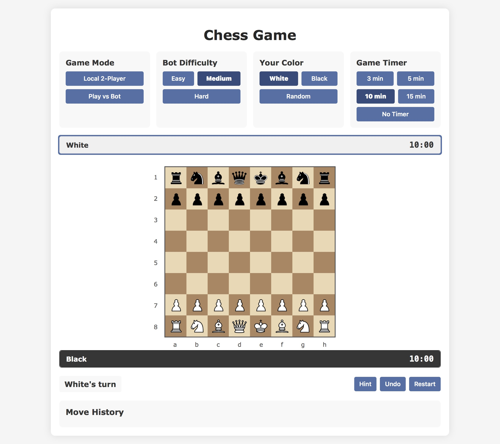

# ♟️ Classic Chess JS 

[](LICENSE)


A complete chess game built with vanilla JavaScript. Play against a friend or challenge the AI with three difficulty levels - perfect for both casual players and chess enthusiasts!

## 🌐 Live Demo

<div align="center">
  <a href="https://classic-chess.netlify.app/">
    
  </a>
  <br>
  <strong>Play now:</strong> <a href="https://classic-chess.netlify.app/">https://classic-chess.netlify.app/</a>
  <br>
  [](https://app.netlify.com/sites/classic-chess/overview)
</div>

## 📂 File Structure

```
classic-chess-js/
├── pieces/               # All chess piece images
│   ├── white_pawn.png
│   ├── black_king.png
│   └── ... (12 total)
├── assets/               # Additional assets
│   └── screenshot.png    # Game preview
├── index.html           # Main game interface
├── styles.css           # All visual styling
├── script.js            # Game logic (2000+ lines)
├── README.md            # This document
└── LICENSE              # MIT License
```

## 🎮 Features

**Game Modes:**
- 👥 Local 2-player
- 🤖 AI opponent (Easy/Medium/Hard)

**Full Chess Rules:**
- ♜ Castling (both kingside and queenside)
- ♟ En passant captures
- ♛ Pawn promotion
- ⚔️ Check/checkmate detection
- 🏳️ Stalemate recognition

**Player Tools:**
- 💡 Smart move hints
- ↩️ Unlimited undo
- ⏱️ Adjustable timers (3/5/10/15 min)
- 🔄 Instant restart

## 🚀 Quick Start

1. **Download the game**
   ```bash
   git clone https://github.com/sagarbudhwani/classic-chess-js.git
   
2. **Open in browser**
   - Simply double-click `index.html`
   - Works in Chrome, Firefox, Edge (no server needed)

3. **Start playing!**
   - Choose game mode and settings
   - Drag pieces or click to move

## 🤖 AI Difficulty Explained

| Level  | Algorithm | Speed | Skill |
|--------|-----------|-------|-------|
| Easy   | Random valid moves | Instant | Beginner |
| Medium | 1-ply greedy search | Fast | Intermediate |
| Hard   | 3-ply minimax | 1-2 sec delay | Advanced |

```javascript
// Sample AI evaluation (from script.js)
function evaluatePosition() {
  // Values pieces: pawn=1, knight/bishop=3, rook=5, queen=9
  // Considers: king safety, piece activity, pawn structure
}
```

## 🛠️ Development Highlights

**Tricky Parts I Solved:**
1. **Castling Logic**  
   Had to track if king/rook moved while ensuring no squares are under attack

2. **En Passant**  
   Implemented special state tracking after pawn double-moves

3. **Check Detection**  
   Optimized by checking attack paths to king instead of full board scan

**You Might Notice:**
- The AI pauses slightly on Hard difficulty (better simulation!)
- Mobile touch works but desktop is smoother
- Promotion always goes to queen (simpler UI)

## 🌟 Tips for Players

1. Use **hints** when learning (lightbulb button)
2. **Right-click** cancels piece selection
3. Enable **timer** for tournament-style games

## 📜 License

MIT © [Sagar Budhwani] - Free to use, modify, and share! See [LICENSE](LICENSE).
